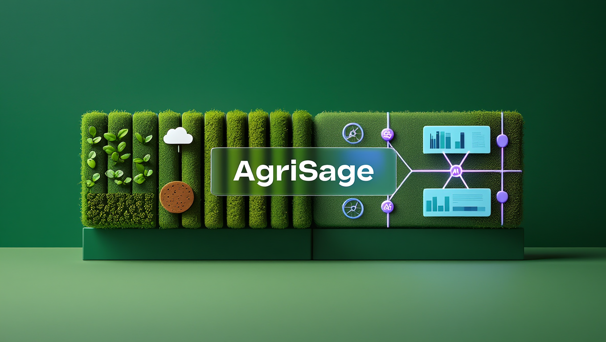
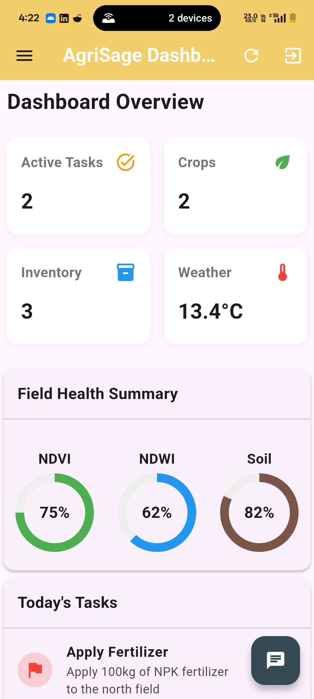
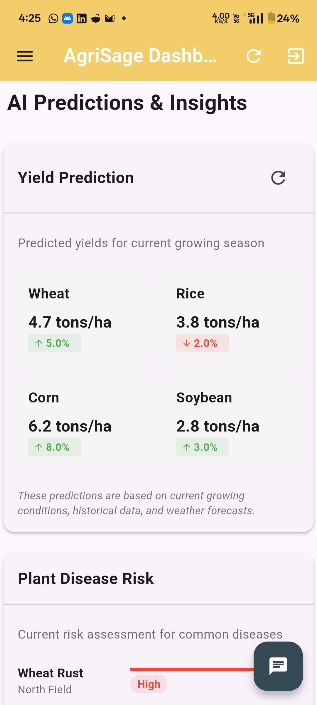
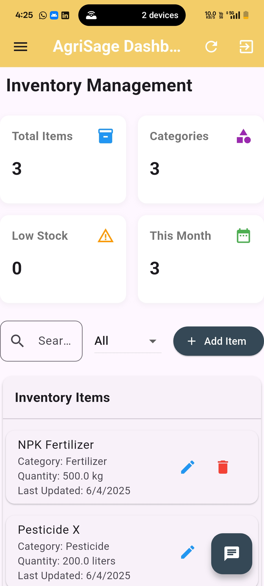
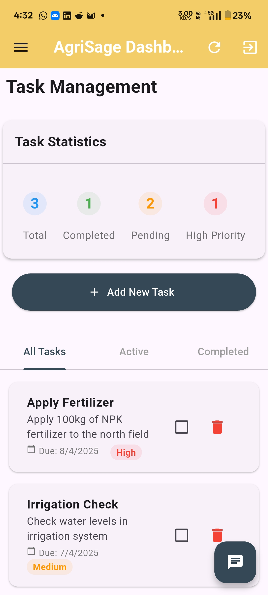
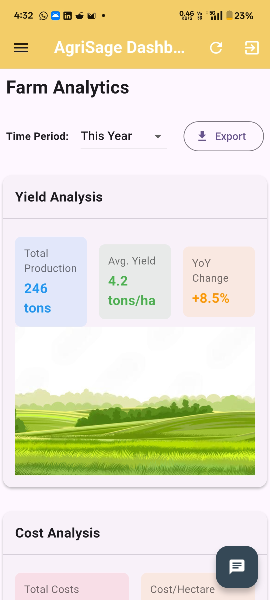
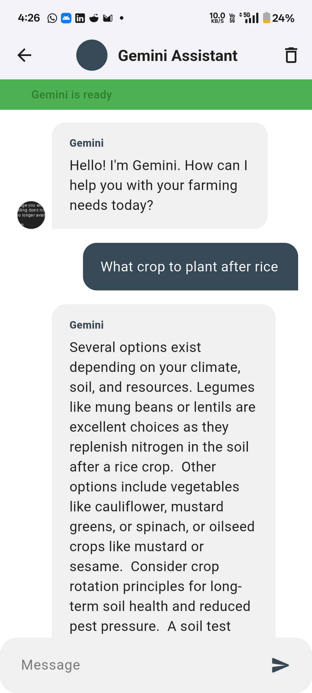
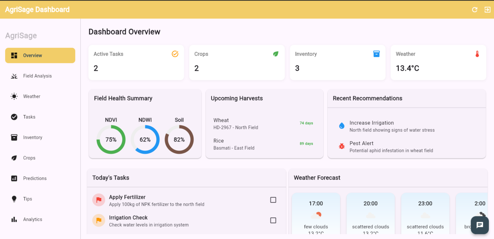
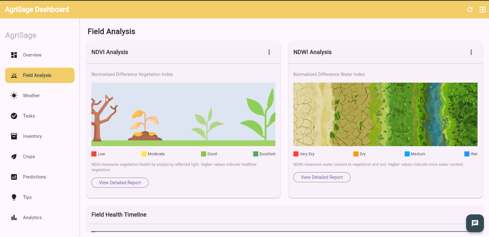

# AgriSage

<p align="center">
  
</p>

## Introduction

AgriSage is an AI-powered agricultural advisory mobile application built with Flutter. Designed to empower small and marginal farmers, AgriSage provides personalized, real-time recommendations on crop management, resource optimization, and sustainable farming practices using machine learning, remote sensing, and IoT technologies.

The application serves as an intelligent guide for farmers, leveraging satellite imagery (analyzing NDVI, NDWI, etc.) and AI models to provide actionable insights. With a 24/7 AI assistant powered by Google's Gemini API, farmers can get immediate help and answers to their questions.

## Features

### 🌱 Personalized Crop Advisory
- AI-driven recommendations for planting, irrigation, fertilization, and pest control
- Tailored advice based on local conditions and crop type
- Sustainable farming practice suggestions

### ☁️ Real-Time Weather & Climate Updates
- Hyperlocal weather forecasts
- Climate alerts for extreme weather events
- Seasonal climate predictions

### 📊 IoT & Remote Sensing Dashboard
- Monitor soil moisture, temperature, and nutrient levels through IoT sensors
- Access satellite and drone imagery for crop health analysis
- Visual analytics of farm conditions

### 💧 Resource Management Tools
- Calculate optimal water usage
- Determine fertilizer requirements
- Recommend energy-efficient practices

### 🤖 Predictive AI Features
- Optimal irrigation timing recommendations
- Best sowing windows calculation
- Precise pesticide application guidance
- Crop suitability recommendations
- Estimated yield predictions

### 📝 Farm Management System
- Task management
- Inventory tracking
- Crop lifecycle management
- Financial record keeping

### 💬 24/7 AI Assistant
- Instant answers to farming questions
- Powered by Google's Gemini API
- Continuous learning and improvement

## System Architecture

<p align="center">
  
</p>

<p align="center">
  
</p>

<p align="center">
  
</p>


## Screenshots

### Mobile Version

<p align="center">
  
  
  
</p>
<p align="center">
  <b>Dashboard</b> &nbsp;&nbsp;&nbsp;&nbsp;&nbsp;&nbsp;&nbsp;&nbsp;&nbsp;&nbsp;&nbsp;&nbsp;&nbsp;&nbsp;&nbsp;&nbsp;&nbsp;&nbsp;&nbsp;&nbsp;&nbsp;&nbsp;&nbsp;&nbsp;&nbsp;&nbsp;&nbsp;&nbsp;&nbsp;&nbsp;&nbsp;&nbsp;&nbsp;
  <b>Crop Analysis</b> &nbsp;&nbsp;&nbsp;&nbsp;&nbsp;&nbsp;&nbsp;&nbsp;&nbsp;&nbsp;&nbsp;&nbsp;&nbsp;&nbsp;&nbsp;&nbsp;&nbsp;&nbsp;&nbsp;&nbsp;&nbsp;&nbsp;&nbsp;&nbsp;&nbsp;&nbsp;
  <b>Inventory Management</b>
</p>

<p align="center">
  
  
  
</p>
<p align="center">
  <b>Task Management</b> &nbsp;&nbsp;&nbsp;&nbsp;&nbsp;&nbsp;&nbsp;&nbsp;&nbsp;&nbsp;&nbsp;&nbsp;&nbsp;&nbsp;&nbsp;&nbsp;
  <b>Advanced Analytics</b> &nbsp;&nbsp;&nbsp;&nbsp;&nbsp;&nbsp;&nbsp;&nbsp;&nbsp;&nbsp;&nbsp;&nbsp;&nbsp;&nbsp;&nbsp;&nbsp;
  <b>AI Assistant</b>
</p>

### Desktop Version

<div style="clear: both; margin-top: 30px;">
  
  <h4>Comprehensive Dashboard</h4>
</div>

<div style="clear: both; margin-top: 30px;">
  
  <h4>Field Analysis Dashboard</h4>
</div>

## Installation

### Prerequisites
- Flutter 3.0.0 or higher
- Dart 2.17.0 or higher
- Android Studio / Xcode
- Firebase account
- OpenWeatherMap API key
- Google Cloud account (for Gemini API)

### Setup Instructions

1. **Clone the repository**
   ```
   git clone https://github.com/yourusername/AgriSage.git
   cd AgriSage
   ```

2. **Install dependencies**
   ```
   flutter pub get
   ```

3. **Configure API keys**
   - Create a `lib/secrets.dart` file with the following structure:
   ```dart
   class Secrets {
     static const apiKey = 'YOUR_GEMINI_API_KEY';
     static const weatherApiKey = 'YOUR_OPENWEATHERMAP_API_KEY';
   }
   ```

4. **Setup Firebase**
   - Follow the Firebase setup instructions for Flutter:
     https://firebase.google.com/docs/flutter/setup
   - Add your `google-services.json` (Android) and `GoogleService-Info.plist` (iOS) to the appropriate directories

5. **Run the application**
   ```
   flutter run
   ```

## For Google Solution Challenge Submission

AgriSage addresses the following UN Sustainable Development Goals:
- SDG 2: Zero Hunger
- SDG 12: Responsible Consumption and Production
- SDG 13: Climate Action
- SDG 15: Life on Land

The application helps improve agricultural productivity while promoting sustainable practices, reducing resource waste, adapting to climate change, and preserving ecosystems.

## Acknowledgments

- Flutter and Dart teams for the amazing framework
- Google for the Gemini API
- OpenWeatherMap for weather data
- All contributors and testers
